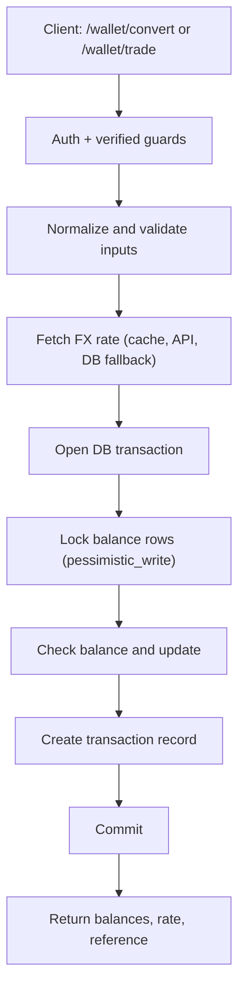
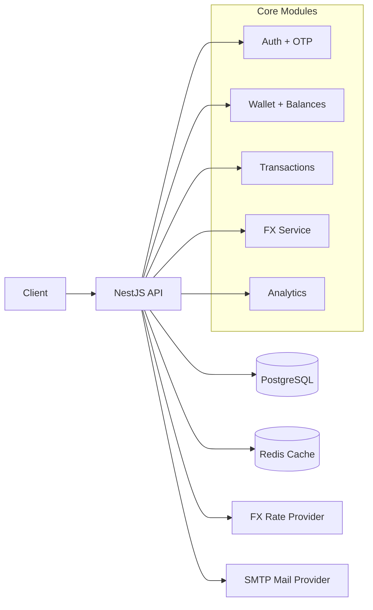

# FX Trader API

Backend API for an FX trading app built with NestJS. It provides email OTP
registration, JWT auth, wallet balances, currency conversion/trades, and
transaction history with FX-rate caching.

## Features

- Email OTP registration + JWT authentication
- Wallets with balances, funding, conversion, and trade flows
- Transaction history and stats
- FX rates with cache + DB fallback snapshots
- Swagger API docs

## Tech Stack

- NestJS, TypeORM
- PostgreSQL
- Redis (optional cache)
- JWT, Nodemailer, Swagger
- ExchangeRate-API (FX rates)
- Jest (tests)
- Docker + Docker Compose (local infra)

## Requirements

- Node.js (LTS)
- PostgreSQL
- Redis (optional, for FX cache)

## Setup

Docker (quick start):
```bash
docker compose up --build
```

Local development:
```bash
npm install
```

Copy the sample env file, then run migrations and start the app:

```bash
cp .env.example .env
npm run migration:run
npm run start:dev
```

Swagger docs will be available at `http://localhost:3000/api/docs`.

## Assumptions

- Wallet is created at registration time.
- Wallet balances are created lazily on first fund/convert, not pre-seeded.
- Redis is optional; if `REDIS_HOST` is not set, FX caching runs in-memory only.
- FX rates come from the configured API and fall back to the latest DB snapshot if the API fails.
- `trade` is implemented as `convert` with `TransactionType.TRADE`.

## API Overview

- Auth flow: `POST /auth/register` -> `POST /auth/verify` -> `POST /auth/login`
- Resend OTP: `POST /auth/resend-otp`
- Wallet balances: `GET /wallet`
- Fund wallet: `POST /wallet/fund`
- Convert currency: `POST /wallet/convert`
- Trade currency: `POST /wallet/trade`
- Transactions (paginated): `GET /transactions` and `GET /transactions/:reference`
- Transaction stats: `GET /transactions/stats`
- Analytics (admin): `GET /analytics/summary`

Auth note: Wallet and transaction endpoints require JWT + verified email. FX endpoints are public.

## Architectural Decisions (Summary)

- Multi-currency balances are stored per currency with a unique `(wallet_id, currency)` constraint.
- Funding/convert/trade run inside a DB transaction with `pessimistic_write` locks on balances.
- FX rate fetch happens before the DB transaction to avoid holding locks during network calls.
- FX rates are cached (Redis/in-memory) and persisted as DB snapshots for fallback and audit.
- OTPs are stored in a separate table and email verification is required before wallet actions.
- Key user actions are recorded as activity logs for lightweight analytics.

## Environment Variables

All required variables are documented in `.env.example`.

## Useful Scripts

```bash
# development
npm run start:dev

# production
npm run start:prod

# lint
npm run lint

# unit tests
npm run test

# e2e tests
npm run test:e2e

# test coverage
npm run test:cov
```

## Tests

- `WalletService` unit tests cover funding, conversion/trade, balance retrieval, and common edge cases.

## Diagrams (Optional)

### Trading / Conversion Flow



### System Architecture (High-level)



Docker will start PostgreSQL, Redis, and the API, then run migrations
automatically on startup.
